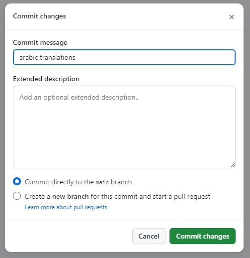

# Changes and Upgrades

When making developments to this extension, follow either of the following processes


## Adding translations in GitHub

To add translations into another language, edit the following files:

- Translations: [files/custom/Espo/Modules/CVADeDuplication/Resources/i18n/](https://github.com/IFRC-Secretariat/espocrm-cva-duplicate-check/tree/main/files/custom/Espo/Modules/CVADeDuplication/Resources/i18n)

There is a folder for each language code, e.g. `ar_AR` is for Arabic. In each language folder, there are files which give translations for different parts of the site. To add the translations, change the value on the right hand side, after the `:` symbols.

1. Open the file to translate in GitHub
2. Click the pencil icon on the top right of the file:

    

3. Make the changes, by changing the text after the `:` symbol, inside the quotes `" "`. E.g. in `Admin.json` in `ar_AR` for Arabic, you would change this:
    ```json
    {
        "labels": {
            "Import": "Tools",
            "Teams": "Partners"
        }
    }
    ```
    to:
    ```json
    {
        "labels": {
            "Import": "أدوات",
            "Teams": "الشريك"
        }
    }
    ```
4. When you're done, click the green `Commit changes...` button on the top right:

    

5. In the pop-up, write a short commit message in the `Commit message` box, and then click the green `Commit changes` button.

    


### Translating email templates

Email templates are at:

- User access email template: [files/custom/Espo/Custom/Resources/templates/accessInfo/](https://github.com/IFRC-Secretariat/espocrm-cva-duplicate-check/tree/main/files/custom/Espo/Custom/Resources/templates/accessInfo)
- User portal access email template: [files/custom/Espo/Custom/Resources/templates/accessInfoPortal/](https://github.com/IFRC-Secretariat/espocrm-cva-duplicate-check/tree/main/files/custom/Espo/Custom/Resources/templates/accessInfoPortal)
- Two-factor authentication email template: [files/custom/Espo/Custom/Resources/templates/twoFactorCode/](https://github.com/IFRC-Secretariat/espocrm-cva-duplicate-check/tree/main/files/custom/Espo/Custom/Resources/templates/twoFactorCode)

Open the language code folder, e.g. `ar_AR` for Arabic, or add it if it isn't there. Replace the file content with the translation. 


## Making changes in GitHub

1. Edit the files in GitHub (more information [here](https://docs.github.com/en/repositories/working-with-files/managing-files/editing-files)).

2. Update the version in the [manifest.json](https://github.com/IFRC-Secretariat/espocrm-cva-duplicate-check/blob/main/manifest.json).

3. Commit the changes.

4. Run unit and integration tests: go to [Run unit and integration tests](https://github.com/IFRC-Secretariat/espocrm-cva-duplicate-check/actions/workflows/run-tests.yml) in `Actions`. Click the `Run workflow` button. You can see the progress of the tests under [Actions](https://github.com/IFRC-Secretariat/espocrm-cva-duplicate-check/actions).


## Making changes locally

1. Make changes to the files locally. You can set up a local instance to test on and make changes, [as described in the documentation](https://docs.espocrm.com/administration/installation-by-script/):

    ```bash
    wget https://github.com/espocrm/espocrm-installer/releases/latest/download/install.sh
    sudo bash install.sh
    ```
    Make sure that everything works as expected. The following [EspoCRM commands](https://docs.espocrm.com/administration/commands/) are useful if making changes:
    ```bash
    php clear_cache.php # Clear the cache for new changes to take effect
    php rebuild.php # Rebuild to clear the cache and update the database
    ```

2. Update the version in the `manifest.json`.

3. Push changes to GitHub.

4. Run unit and integration tests: go to [Run unit and integration tests](https://github.com/IFRC-Secretariat/espocrm-cva-duplicate-check/actions/workflows/run-tests.yml) in `Actions`. Click the `Run workflow` button. You can see the progress of the tests under [Actions](https://github.com/IFRC-Secretariat/espocrm-cva-duplicate-check/actions).

5. If the tests have passed, [create a release](https://docs.github.com/en/repositories/releasing-projects-on-github/managing-releases-in-a-repository). This will automatically run the tests again.


## Uploading a new version of the extension

1. Run the [automated tests](https://github.com/IFRC-Secretariat/espocrm-cva-duplicate-check/blob/main/docs/04-testing.md#automated-testing-unit-and-integration-tests) to test the new extension.

2. Zip the `files`, `scripts`, and `manifest.json` folders and file. You can do this by zipping the files locally, or downloading the zipped files from Github (from the repository page under `Code`, or by downloading a release) and then unzipping, and zipping one level lower. 

3. Go to the EspoCRM **staging** site.

    1. Go to `Administration` → `Extensions`. Uninstall the currently installed extension. Upload the zip file, and click the `Install` button.

    4. Run the [manual tests in the site](https://github.com/IFRC-Secretariat/espocrm-cva-duplicate-check/blob/main/docs/04-testing.md#manual-testing) to test the new extension.

4. Go to the EspoCRM **main** site. 

    1. Put the site into maintenance mode by going to `Administration` → `Settings`, and checking the `Maintenance Mode` box.

    2. Go to `Administration` → `Extensions`. Uninstall the currently installed extension. Upload the zip file, and click the `Install` button.