# Testing

This file contains information about how to test the extension, including running automated EspoCRM unit and integration tests, and testing manually.

## Automated testing: unit and integration tests

To run EspoCRM unit and integration tests: go to [Run unit and integration tests](https://github.com/IFRC-Secretariat/espocrm-cva-duplicate-check/actions/workflows/run-tests.yml) in `Actions`. Click the `Run workflow` button. You can see the progress of the tests under [Actions](https://github.com/IFRC-Secretariat/espocrm-cva-duplicate-check/actions).

This runs EspoCRM tests, but does not test functionality specific to this extension.

## Manual testing

This testing assumes testing from a blank installation, with this extension installed. You can skip steps if you already have them.

Set up the tests by doing the following:

1. Create two Partners, e.g. with names `SARC` and `WFP`. Set their roles to `Partner`.

2. Create three users with the following info. Click `Save`.

    | User name | Email | Type | Is Active | Partners | Password | Send Email with Access Info to User |
    | -------- | ------- | ------- | ------- | ------- | ------- | ------- | 
    | sarc_user | sarc@test.org | Regular | ✔ | SARC | 5888IHBKOQmWernj | x |
    | sarc_user_2 | sarc2@test.org | Regular | ✔ | SARC | 7de2wvSz7464NRAj | x |
    | wfp_user | wfp@test.org | Regular | ✔ | WFP | 44NHX9swGHZ4641x | x |

### Test user required fields and password

1. Go to the `Create user` form.

2. Check that the following fields are required fields, by submitting the form without them. This should give a `Not valid` error.

    - User name
    - Email
    - Partners

3. Add the following information:

    | User name | Email | Type | Is Active | Partners |
    | -------- | ------- | ------- | ------- | ------- | 
    | test_user | test@test.org | Regular | ✔ | SARC |

4. Set the password to "password" and click `Save`. This should give a `Not valid` error, and show the message `Must be at least 16 characters long.` on the password field.

5. Set the password to "passwordpassword" and click `Save`. This should give a `Not valid` error, and show the message `Must contain letters of both upper and lower case.` on the password field.

6. Set the password to "passwordPassword" and click `Save`. This should give a `Error 403: Access denied Password is weak.` error.

7. Set the password to "passwordPassword123" and click `Save`. This should give a `Error 403: Access denied Password is weak.` error.

8. Set the password to "passwordPassword1234" and click `Save`. This should save successfully.

9. Delete the user.

### Test user permissions

Test that users are only able to view data from their Partner.

1. Login as `sarc_user`.

2. Upload cash distribution data at `data/cash_distributions_user_permissions.csv`. Set the following fields:

    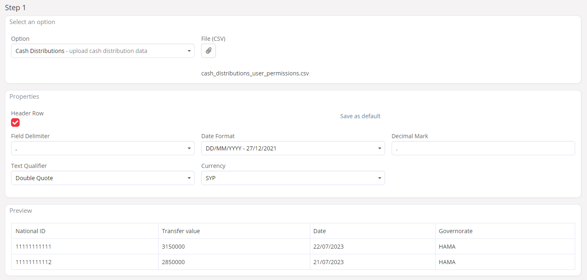

3. Set the field mapping, and click `Run Import`.

    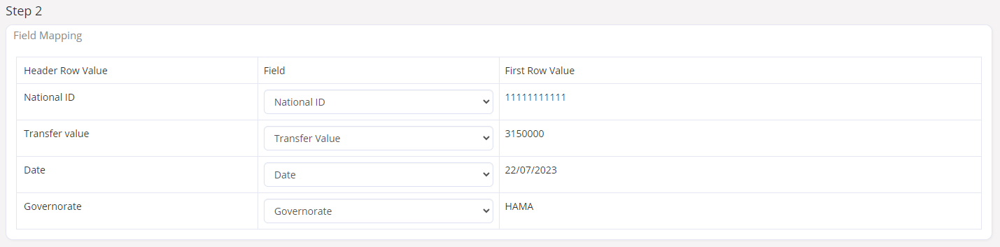

4. See that the 3 rows of data have been imported successfully.

    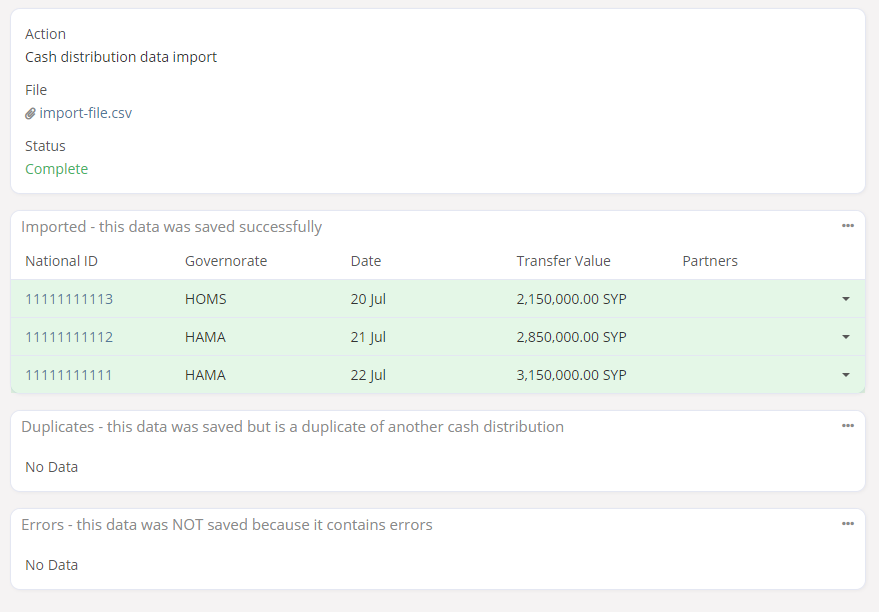

5. View the results in the `Cash Distributions` list:

    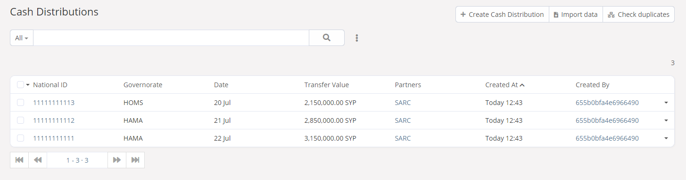

6. Logout, and login as `sarc_user_2`. Verify that you **can** see the data in the `Cash Distribution` list, created by `sarc_user`:

    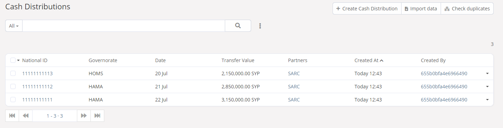

8. Logout, and login as `wfp_user`. Verify that you **can't** see the data in the `Cash Distribution` list created by `sarc_user`:

    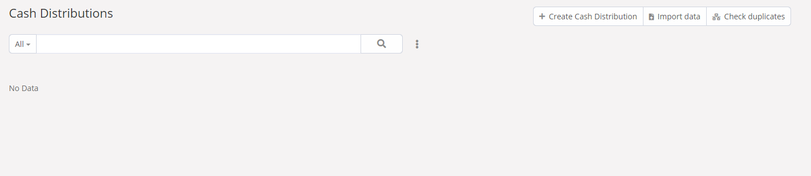

10. Logout, and login as `admin`. Verify that you **can** see the data in the `Cash Distribution` list, created by `sarc_user`:

    

11. Remove all data and imports.

### Test cash distribution errors

1. Login as `sarc_user`.

2. Go to `Tools`, and upload the data in `data/cash_distributions_errors.csv`. Set the following information, and click `Next`.

    | Header row | Field Delimiter | Date Format | Decimal Mark | Text Qualifier | Currency |
    | -------- | ------- | ------- | ------- | ------- | ------- | 
    | ✔ | , | DD/MM/YYYY | . | Double Quote | SYP |

    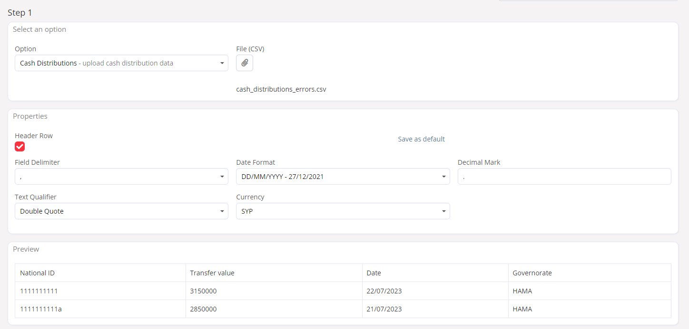

3. Set the field mapping, and click `Run Import`.

    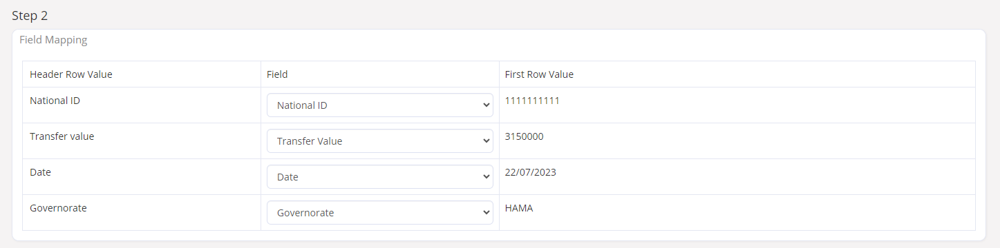

4. The results should show 1 successfully imported row, and 5 errors:

    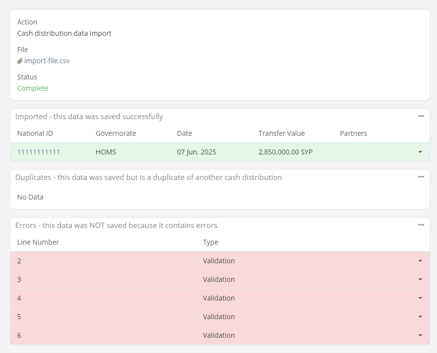

5. Check that each error contains the following validation failures:

    | Error Line Number | Field | Validation | 
    | -------- | ------- | ------- | 
    | 2 | National ID | Pattern Matching | 
    | 3 | National ID | Pattern Matching | 
    | 4 | Transfer Value | Valid | 
    | 5 | Transfer Value | Valid | 
    | 6 | Date | Valid | 

6. Remove all `Cash Distribution` data and imports.

### Test duplicate check errors

1. Login as `sarc_user`.

2. Go to `Tools`, and upload the data in `data/duplicate_check_errors.csv`. Set the following information, and click `Next`.

    | Header row | Field Delimiter | Text Qualifier |
    | -------- | ------- | ------- | 
    | ✔ | , | Double Quote | 

    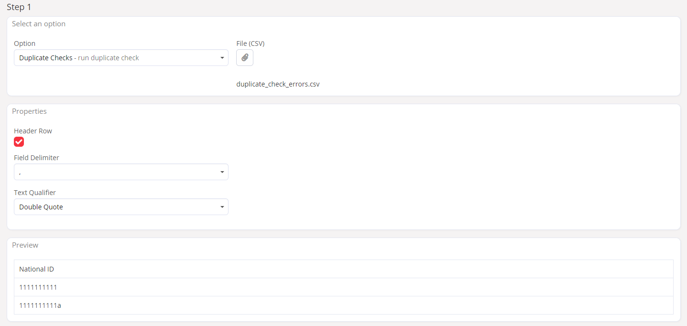

3. Set the field mapping, and click `Run Import`.

    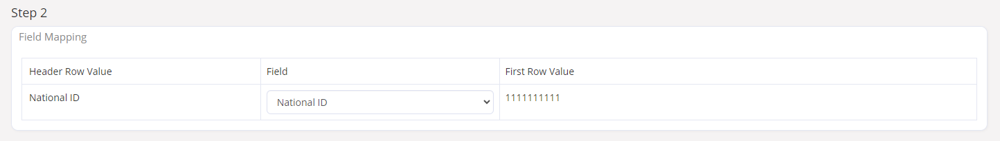

4. The results should show 1 successfully imported row, and 2 errors:

    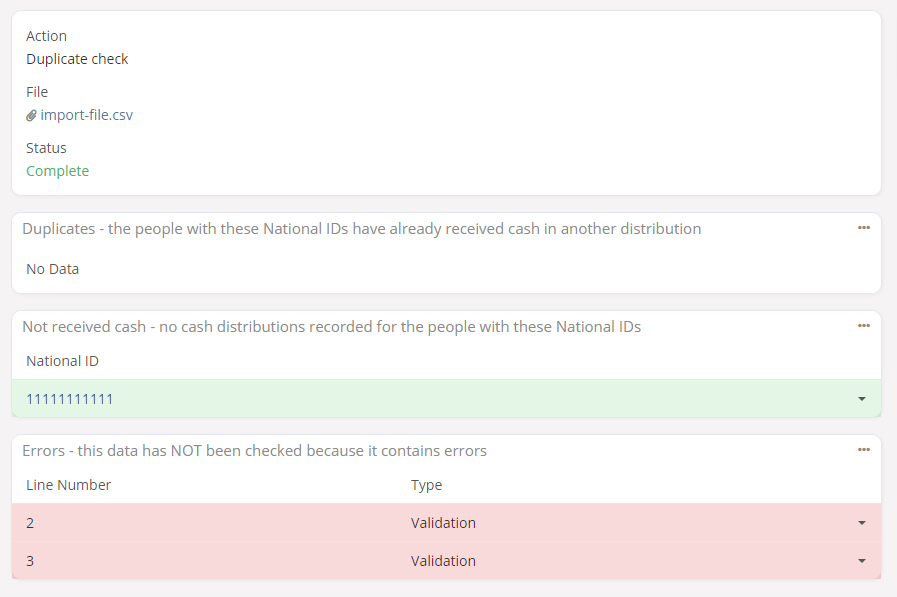

5. Check that each error contains the following validation failures:

    | Error Line Number | Field | Validation | 
    | -------- | ------- | ------- | 
    | 2 | National ID | Pattern Matching | 
    | 3 | National ID | Pattern Matching | 

6. Remove all data and imports.

### Test duplicate checking

Login as `admin`. Make sure that there is no data in the `Cash Distributions` list; if there is, remove it.

1. Login as `sarc_user` and import `Cash Distribution` data:

    1. Import the `Cash Distribution` data in `data/test_duplicate_checking/1_cash_distributions.csv`. Click `Next`. 

        

    2. Set the field mapping, and click `Run Import`.

        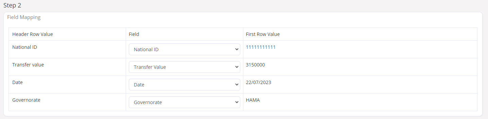

    3. The results should show 3 successfully imported rows with National IDs `11111111111`, `11111111112`, and `11111111113`. There should be no duplicates, and no errors.

        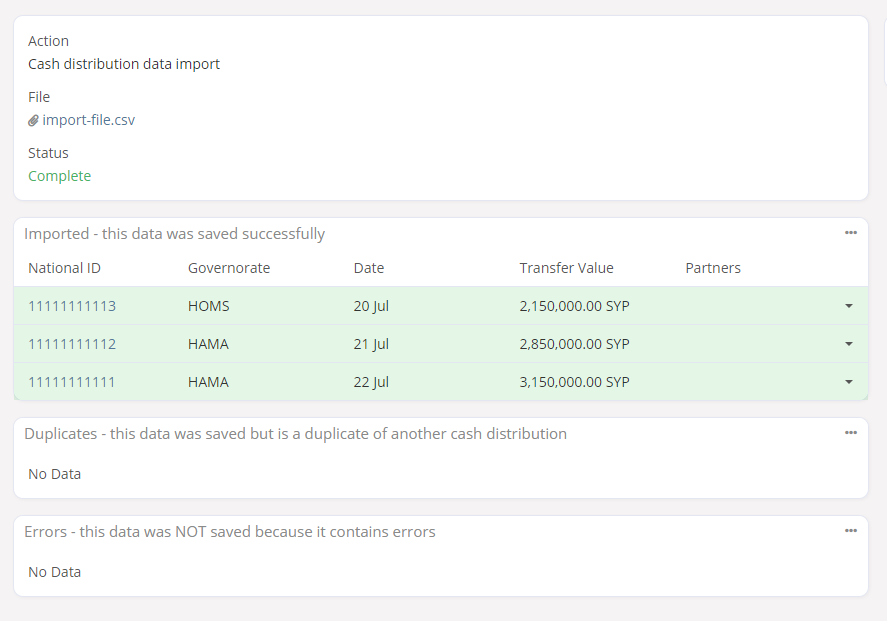

2. Still as `sarc_user`, run a duplicate check.

    1. Import the data in `data/test_duplicate_checking/2_duplicate_checks.csv`. Click `Next`. 

    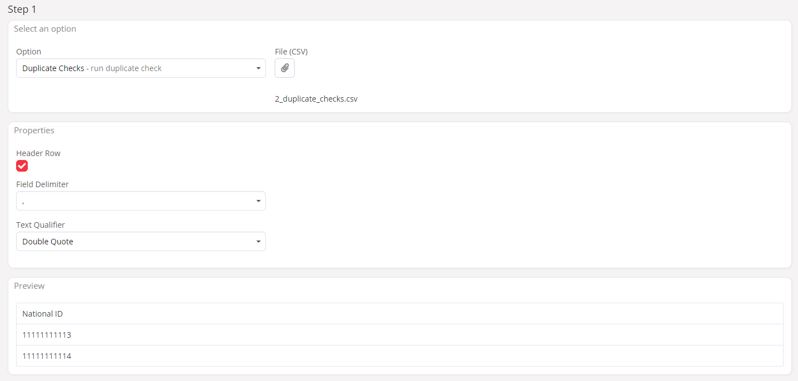

    2. Set the field mapping, and click `Run Import`.

        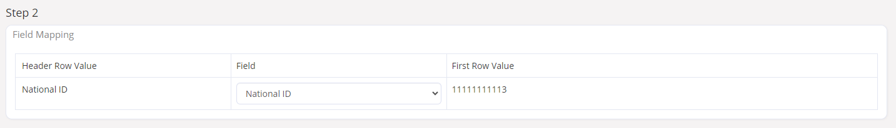

    3. Check that the results contain 1 duplicate (`11111111113`), and 1 non-duplicate (`11111111114`), as below:

        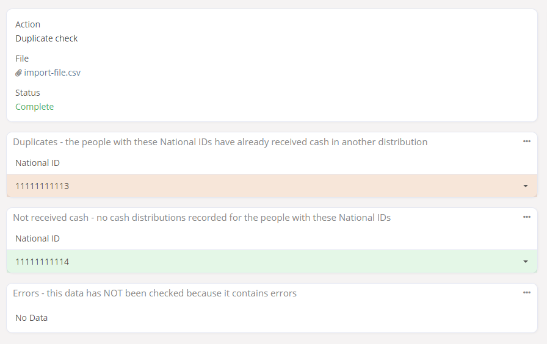

3. Logout, and login as `wfp_user`. Run a duplicate check.

    1. Import the data in `data/test_duplicate_checking/3_duplicate_checks.csv`. Click `Next`. 

        

    2. Set the field mapping, and click `Run Import`.

        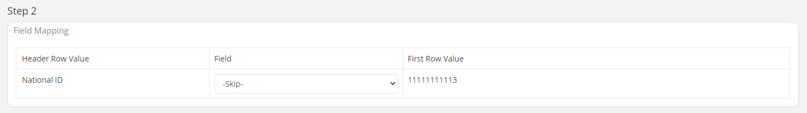

    3. Check that the results contain 1 duplicate (`11111111113`), and 2 non-duplicates (`11111111115` and `11111111114`), as below:

        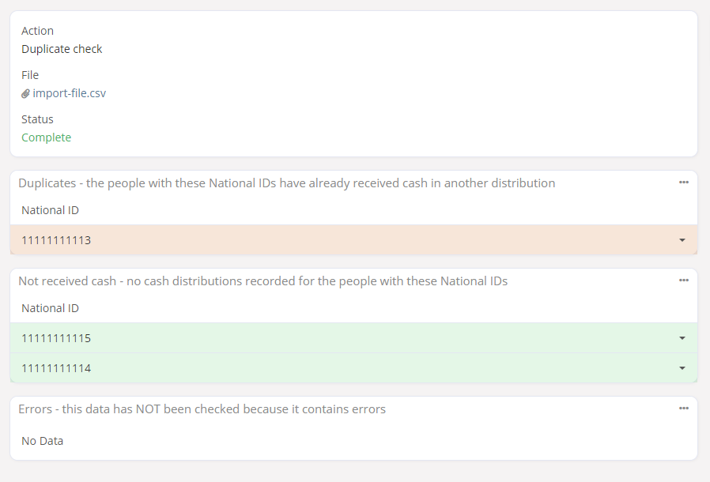

4. Still as `wfp_user`, import cash distribution data.

    1. Import the `Cash Distribution` data in `data/test_duplicate_checking/4_cash_distributions.csv`. Click `Next`. 

        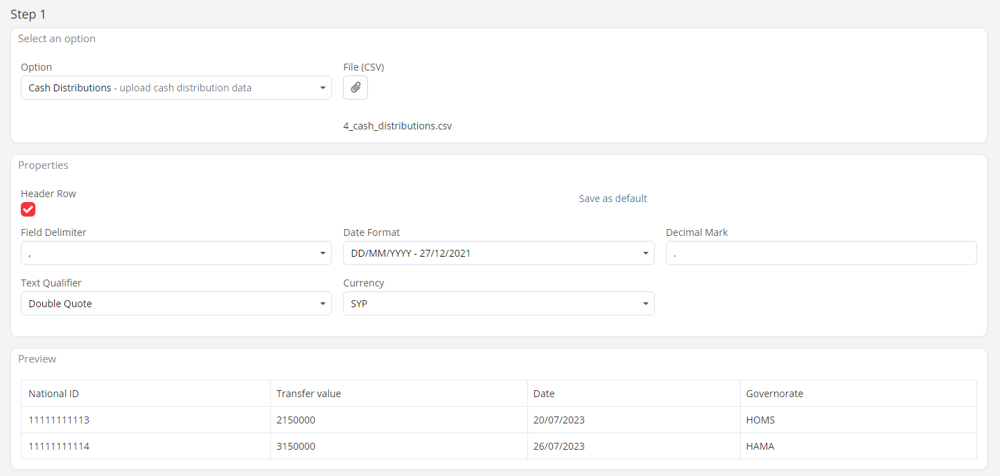

    2. Set the field mapping, and click `Run Import`.

        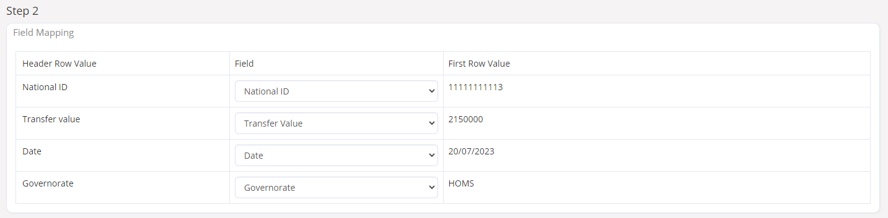

    3. The results should show 4 successfully imported rows with National IDs `11111111113`, `11111111114`, `11111111115`, and `11111111116`. There should be 1 duplicate with National ID `11111111113`, and no errors.

        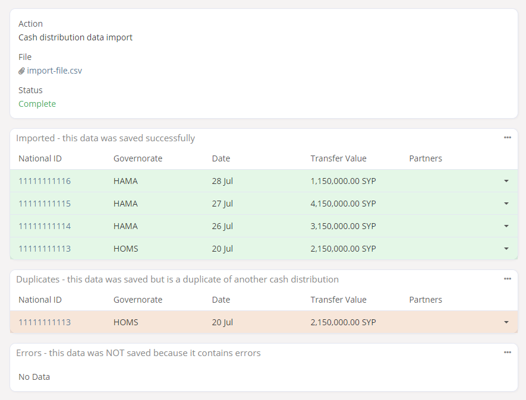